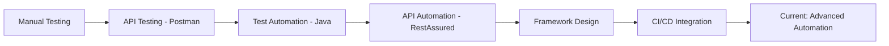

# Hi there! 👋 I'm Nikhil

<div align="center">
  
### 🎯 QA Engineer | API Testing Specialist | Automation Enthusiast

[](https://www.linkedin.com/in/nikhilhadke777/)
[](mailto:hadkenikhil777@gmail.com)
[](https://www.naukri.com/mnjuser/profile)


</div>

---

## 💼 Professional Summary

**5+ Years** of experience in **Manual & API Testing** with a strong foundation in quality assurance and test automation. Currently specializing in building robust API automation frameworks using **RestAssured** and **Java**. Passionate about delivering high-quality software through comprehensive testing strategies and continuous learning.

---

## 🚀 Technical Expertise

### 🔍 Testing & Quality Assurance
```
✅ Manual Testing          ⭐⭐⭐⭐⭐
✅ API Testing             ⭐⭐⭐⭐⭐
✅ Functional Testing      ⭐⭐⭐⭐⭐
✅ Regression Testing      ⭐⭐⭐⭐⭐
✅ Test Case Design        ⭐⭐⭐⭐⭐
✅ Bug Tracking & Reporting ⭐⭐⭐⭐⭐
```

### 🛠️ Tools & Technologies

<div align="center">

| Category | Technologies |
|----------|-------------|
| **API Testing** |   |
| **Programming** |  |
| **Frameworks** |   |
| **Database** |   |
| **Version Control** |   |
| **CI/CD** |  |
| **Reporting** |  |

</div>

---

## 📊 What I Bring to the Table

<table>
<tr>
<td width="50%">

### 🎯 Testing Excellence
- ✅ **5+ years** of hands-on testing experience
- ✅ Strong understanding of **SDLC** & **STLC**
- ✅ Expertise in **test planning** & **execution**
- ✅ Proficient in **defect lifecycle management**
- ✅ Experience with **Agile/Scrum** methodologies

</td>
<td width="50%">

### 🔧 Technical Skills
- ✅ API testing with **Postman** & **RestAssured**
- ✅ Automation framework design & development
- ✅ **Java** programming for test automation
- ✅ Database testing with **SQL/MySQL**
- ✅ CI/CD integration with **GitHub Actions**

</td>
</tr>
</table>

---

## 🌱 Currently Learning & Growing

```java
public class CareerGrowth {
    public static void main(String[] args) {
        String[] learningGoals = {
            "Advanced API Automation Framework Design",
            "Design Patterns in Test Automation",
            "Git & GitHub Best Practices",
            "CI/CD Pipeline Optimization",
            "Performance Testing Fundamentals"
        };
        
        System.out.println("🚀 Continuously upgrading my skills!");
    }
}
```

---

## 💡 Featured Projects

### 🔹 [API Automation Framework - RestAssured](https://github.com/yourusername/simple-api-automation-restassured)
> Comprehensive REST API testing framework with JWT authentication, POJO-based requests, and ExtentReports integration

**Tech Stack:** RestAssured | TestNG | Maven | Java | GitHub Actions

**Key Features:**
- ✅ JWT Authentication Flow Testing
- ✅ POJO-based Request/Response Handling
- ✅ Comprehensive HTML Reporting
- ✅ CI/CD Integration
- ✅ Multiple API Support (PetStore, DummyJSON)

---

## 📈 GitHub Stats

<div align="center">


</div>

---

## 🎓 Professional Journey



---

## 💼 Core Competencies

<div align="center">

| 🎯 Testing | 🔧 Technical | 🤝 Soft Skills |
|-----------|-------------|---------------|
| Functional Testing | Java Programming | Analytical Thinking |
| API Testing | RestAssured | Problem Solving |
| Regression Testing | TestNG Framework | Team Collaboration |
| Test Automation | Maven Build Tool | Communication |
| Database Testing | SQL Queries | Attention to Detail |
| Agile Testing | Git Version Control | Quick Learner |

</div>

---

## 📫 Let's Connect!

<div align="center">

**I'm always open to interesting conversations and collaboration opportunities!**

[](https://linkedin.com/in/yourprofile)
[](mailto:your.email@gmail.com)
[](https://github.com/yourusername)
[](https://yourportfolio.com)

</div>

---

## 🏆 Achievements & Highlights

- 🎯 **5+ Years** of Quality Assurance Experience
- 🚀 Successfully designed and implemented **API Automation Framework** from scratch
- 📊 Improved test coverage by implementing **automated regression suites**
- 🔍 Identified and reported **critical bugs** preventing production releases
- 👥 Mentored junior QA team members in **API testing** and **automation**
- 📈 Reduced manual testing time by **40%** through automation

---

## 📚 Learning Path

**Currently Focused On:**
- [ ] Advanced REST API Automation Patterns
- [ ] Microservices Testing Strategies
- [ ] Performance Testing with JMeter
- [ ] Contract Testing (Pact)
- [ ] Behavior-Driven Development (Cucumber)

---

<div align="center">

### ⚡ Fun Fact

```
While (coding) {
    coffee++;
    bugs--;
    skills++;
}
```

---

### 💬 Quote I Live By

> *"Quality is not an act, it is a habit."* – Aristotle

---


**Thanks for visiting! Feel free to explore my repositories and reach out for collaboration! 🚀**

</div>
